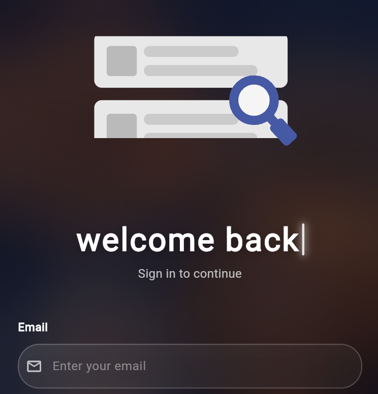
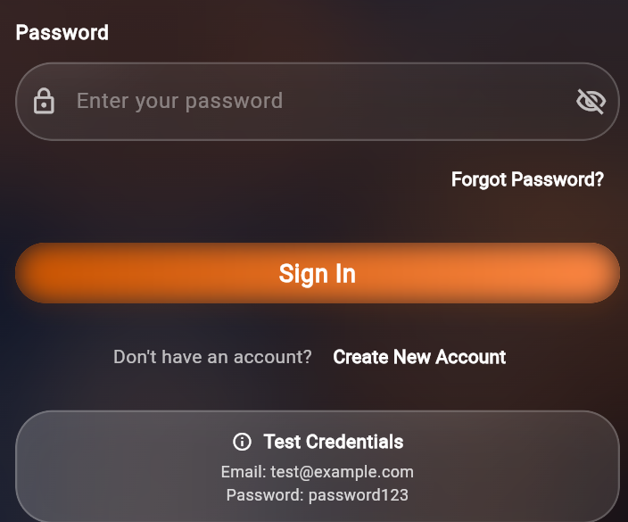
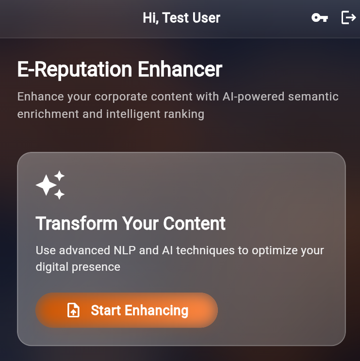
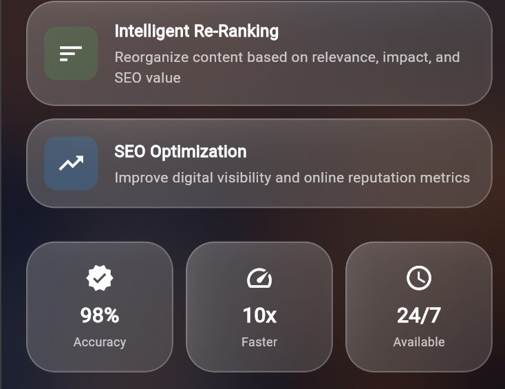
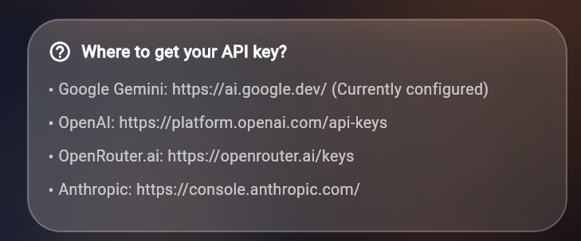
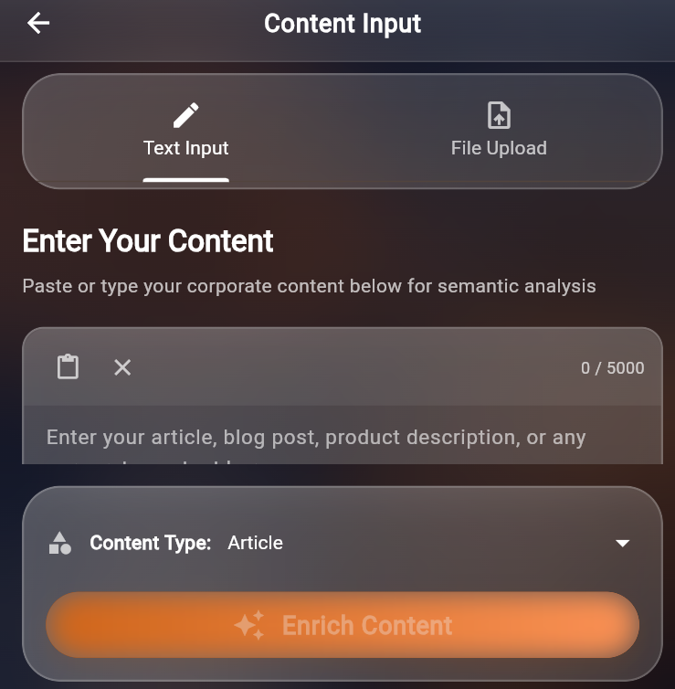
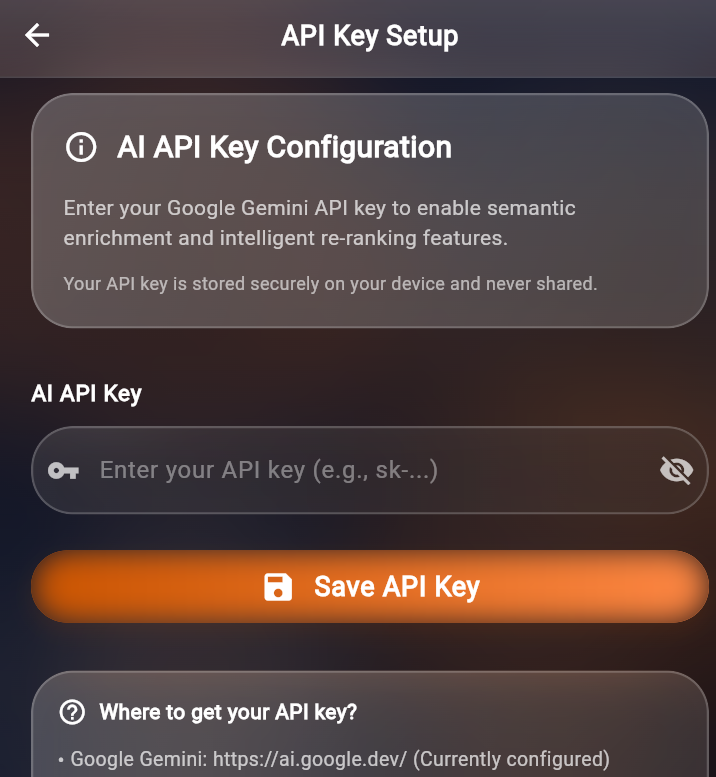

# 🚀 E-Reputation Enhancer Mobile App

A cross-platform **Flutter** mobile application designed to enhance **corporate e-reputation** through semantic enrichment and intelligent re-ranking of digital content using **AI & NLP techniques**.

---

## 📱 Overview

**E-Reputation Enhancer** helps organizations improve their online visibility and brand perception by analyzing, enriching, and ranking digital content such as articles, blog posts, product descriptions, and press releases.

The application focuses on **semantic quality, SEO optimization, and content impact**, providing actionable insights through a modern and intuitive mobile interface.

---

## 🎨 App Preview

  
  
  

  
  
  

  
  

  <i>Real application screenshots demonstrating the full content enhancement workflow.</i>

---

## ✨ Core Features

### 📝 Content Input
- Manual text input or file upload (TXT, DOC, DOCX, PDF)
- Content categorization (articles, blogs, products, press releases)
- Clean and guided input experience

### 🧠 Semantic Enrichment
- AI-powered semantic enhancement
- Automatic keyword extraction & expansion
- SEO scoring and optimization suggestions
- Side-by-side comparison (original vs enriched)

### 📊 Intelligent Re-Ranking
- Multi-criteria scoring system:
  - Relevance Score
  - SEO Score
  - Business Impact Score
  - Overall Composite Score
- Dynamic sorting and filtering
- Insightful analytics per content item

### 🎯 User Experience
- Material 3 design system
- Smooth animations and transitions
- Responsive layout for all devices
- Export and copy-to-clipboard tools

---

## 🏗️ System Architecture

## 🏗️ Architecture
lib/
├── main.dart # App entry point
├── models/
│ └── content_model.dart # Data models
└── screens/
├── home_screen.dart # Dashboard/landing page
├── content_input_screen.dart # Text/file input interface
├── enrichment_results_screen.dart # Semantic enrichment results
└── ranking_screen.dart # Intelligent re-ranking display

### Key Components

- **ContentModel**: Represents the original content with metadata
- **EnrichedContent**: Stores semantically enhanced content with keywords and suggestions
- **RankedContent**: Contains ranking scores and metadata for content items

---

## 🚀 Getting Started

### Prerequisites
- Flutter SDK (3.10.0 or higher)
- Dart SDK
- iOS Simulator / Android Emulator / Physical Device

### Installation

bash
git clone <your-repository-url>
cd your_project
flutter pub get
flutter run

dependencies:
  flutter:
    sdk: flutter
  cupertino_icons: ^1.0.8
  file_picker: ^8.0.0+1
  google_fonts: ^6.2.1
  flutter_markdown: ^0.7.4+1
  intl: ^0.19.0

